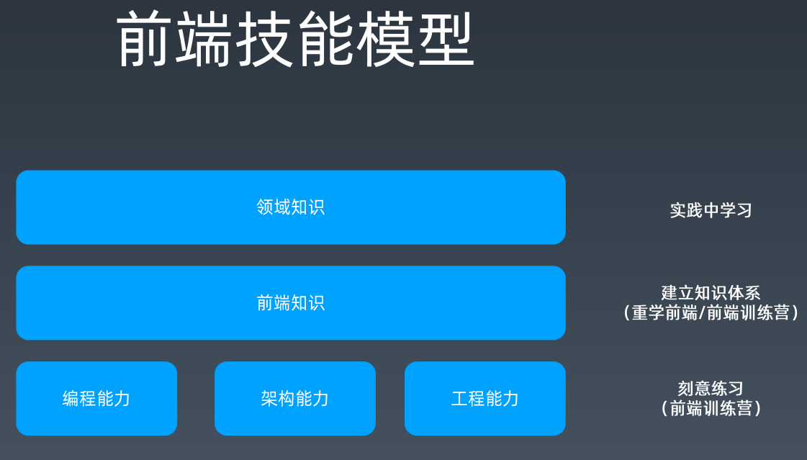
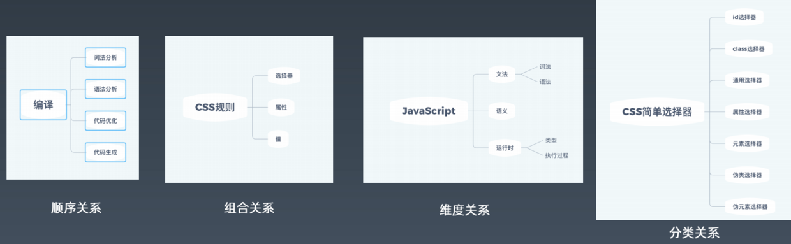
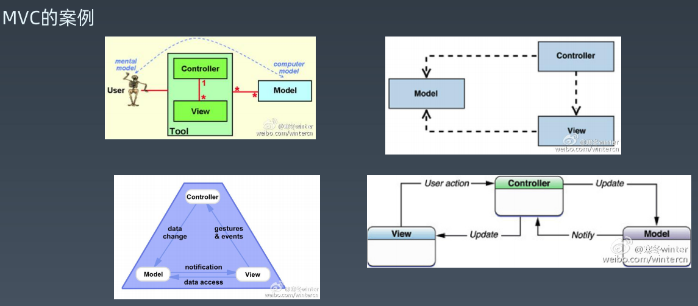

# Week 01 总结

## 建立前端学习体系

* 领域知识
* 前端知识
* 三大能力
  * 编程能力
  * 架构能力
  * 工程能力



### 健壮和改进体系

* 整理

  可通过 顺序、组合、维度、分类、层级、深入浅出、重要程度等关系整理知识。
  

* 追溯

  通过已知线索查找呗，实在不知道就问呗。

  权威网站：

  * [https://www.ecma-international.org/](https://www.ecma-international.org/)

  * [https://www.w3.org/](https://www.w3.org/)

  * [https://scholar.google.com/](https://scholar.google.com/)

  * [https://msdn.microsoft.com](https://msdn.microsoft.com)

  * [https://developer.apple.com](https://developer.apple.com)

  * [https://developer.mozilla.org](https://developer.mozilla.org)

  * [https://whatwg.org/](https://whatwg.org/)

## 前端知识体系

* HTML
* CSS
* JavaScript
* API

详情可到 MDN、whatwg 等网站获取。
介绍一个在 https://html.spec.whatwg.org/multipage/ 上整理 HTML 元素的方法：
打开 浏览器检查，在控制台查找遍历元素
```
Array.prototype.map.call($0.querySelectorAll('code'),
e => e.innerText).join('\n')
```

## 工程体系

### 优秀工程师的素养

* 职业规划
  * 工程师
  * 资深工程师
  * 专家
  * 经理
* 分享心得体验
  * 知乎
  * 博客

### 职业规划

  You are the owner of your career.

  晋升 -> 成长 -> 成就 -> 晋升

* 业务型成就
  * 业务目标
    * 理解公司业务的核心目标
    * 目标转化为指标
  * 技术方案
    * 业务指标到技术指标的转化
    * 形成纸面方案、完成小规模试验
  * 实施方案
    * 确定实施目标、参与人
    * 管理实施进度
  * 结果评估
    * 数据采集、数据报表
    * 向上级汇报

案例：应用手势。<br/>
&nbsp;&nbsp;目标：点击率<br/>
&nbsp;&nbsp;实施：给tab组件增加手势操作，编写通用tab组件文档，向所有导购业务推广，形成制度。<br/>
&nbsp;&nbsp;结果：所有导购业务点击率都提升很多

* 工程型成就
  * 目标
    * 质量、效率
  * 方案与实施
    * 规章制度
    * 库
    * 工具
    * 系统
  * 结果
    * 线上监控

案例：XSS攻击的预防。<br/>
&nbsp;&nbsp;目标&指标：XXS攻击白帽子反馈漏洞<br/>
&nbsp;&nbsp;技术方案：整理安全手册，review历史代码，代码扫描工具<br/>
&nbsp;&nbsp;对全体前端宣讲，整体review代码，更改代码发布流程<br/>
&nbsp;&nbsp;XXS漏洞大幅减少

### 数据驱动
* 目标。分析业务目标
* 现状。采集数据建立数据展示系统
* 方案。设计技术方案，预估数据
* 实施。小规模试验，推广全公司落地形成制度
* 结果。统计最终效果汇报

### 工具链

* 工具链的作用<br/>
  init -> run -> test -> publish
* 工具分类
  * 脚手架
  * 本地调试
  * 单元测试
  * 发布
* 工具链体系
  * 版本问题
  * 数据统计

### 持续集成
* 客户端软件持续集成
  * Daily build
  * BVT
* 前端持续集成
  * Check-in build
  * Lint + Rule Check

### 技术架构
客户端架构：解决软件需求规模带来的复杂性。
服务端架构：解决大量用户访问带来的复杂性。

* 库：有复用价值的代码
  * URL
  * AJAX
  * ENV
* 组件：UI上多次出现的元素
  * 轮播
  * Tab
* 模块：经常被使用的业务区块
  * 登录

## 练习
### 从下图中找到你认为正确的MVC



### 什么是 面向对象

### 什么是 闭包