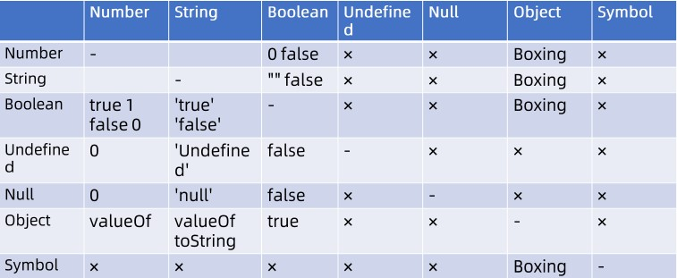

# Week 03 总结

## Expression

### 优先级

表达式中各相邻左右项、运算符之间都有优先级。他们的结构与二叉树一样。

### Member

js中有不同类型的成员，也有多种获取方式：
* a.b
* a[b]
* foo`string`
* super.b
* super['b']
* new.target
	作用于函数内部，可区分函数是否是通过new调用的
* new Foo()

### Call

* foo()
* super()
* foo()['b']
* foo().b
* foo()`abc`

### Update

* a++
* a--
* --a
* ++a

### Unary
* delete a.b
* void foo()
* typeof a
* + a
* - a
* ~ a
* ! a
* await a

### Exponental

`  ** `

### Multiplicative

` *  /  % `

### Additive

` +  - `

### Shift

` <<  >>  >>> `

### Relationship

` < > <= >= instanceof in `

### Equality

` ==  !=  ===  !== `

### Bitwise

` &  ^  | `

### Logical

` &&  || `

### Conditional

` ?: `

### Type Convertion

### 装拆箱

* 装箱(Boxing)：Number String Symbol Boolean，可用于强制类型转换、调用构造器等（返回对象）。注意Number() 与 new Number()不一样，直接调用用于强转，new运算则返回一个对象
* 拆箱(Unboxing)：主要使用 [Symbol.toPrimitive] | valueOf、toString

## Statement

* Atom
  * Grammar
    * 简单语句
    * 复合语句
    * 声明
  * Runtime
    * Compoletion Record
    * Lexical Enviorment

### 简单语句

* ExpressionStatement
* EmptyStatement
* DebuggerStatement
* ThrowStatement
* ContinueStatement
* BreakStatement
* ReturnStatement

### 复合语句

* BlockStatement
* IfStatement
* SwitchStatement
* IterationStatement
* WithStatement
* LabelledStatement
* TryStatement

### 声明

* FunctionDeclaration
* GenneratorDeclaration
* AsyncFunctionDeclaration
* VariableDeclaration
* ClassDeclaration
* LexicalDeclaration

### 预处理

### 作用域
